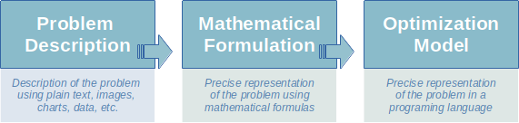

# Mathematical Formulation
After understanding the context and defining the scope of a real-world 
problem, the next step to solve it with mathematical optimization is to 
*formulate* the problem. 

Formulation is the process of creating a *very precise* representation of 
the problem to be solved. We use the word "formulation" because we will be 
literary creating mathematical formulas to model several aspects of the problem.
That's how we fulfil the "very precise" requirement.

In other words, *formulation*, or *mathematical formulation* to be more 
explicit, is a modeling technique that we will be using a lot throughout 
this program.

You may be wondering, why do we need a *very precise* representation?
Well, our end goal is to use a computer to solve the problem. In that case, 
we must speak the language that computers understand. Unfortunately, 
technology has not yet advanced to a point where we  can simply describe the 
problem in plain English to a computer--at  least not the type of problems 
we intend to solve.

In fact, as we will see in the next sections, mathematical formulations can
be effectively translated into an *optimization model*, which is another
precise representation of the problem but, this time, using a programing
language. 

Could we skip the mathematical formulation and write a mathematical
model straight away then? Technically, yes. But we have good reasons
to not do so:
* Mathematical formulation is universal and completely independent
  of any given programing language or API. That's why we can understand 
  formulations that were written in books and scientific articles 
  since the 80's, when many of today's programing languages didn't even exist.
* Mathematical formulations are much more human-readable because the math 
  doesn't get mixed up with programing syntax.
* Typically, the implementation of optimization model involves several
  other modeling tricks, especially in terms of data manipulation, that 
  are only relevant for the given application.

To keep expectations in the right place, we should mention that writing 
formulations is probably the most challenging part of solving problems 
using mathematical optimization. While most people in our community love 
this challenge, some people don't enjoy as much because there is no recipe 
for writing mathematical formulations--it's sort of an art that requires a 
lot of practice.

## Formulation components
A typical formulation has three main components:
* **Decision variables**  
  Are the unknowns of the problem and represent the decisions to be made. 
  For example, a decision variable can be the number of products to 
  manufacture in given machine, or whether to fulfil orders from Facility 
  A or from Facility B. When a value is assigned to each decision variable, 
  we have a solution to the problem.
* **Constraints**  
  Set rules to determine which solutions are feasible, i.e., which solutions 
  meet all the requirements of the problem. These are mathematical 
  equations or inequalities defined as functions of the decision variables. 
  For example, constraints can model resource capacities such as maximum 
  number of daily working hours.
* **Objective function**  
  A function that quantifies all feasible solutions according to certain 
  metrics of interest. This is a mathematical expression to be maximized or 
  minimized, which is also a function of the decision variables. Examples 
  of objectives include minimizing waste and maximizing profit.

Because constraints and the objective function are functions of decision 
variables, the first thing we need to do when writing a formulation is to 
define the decision variables. But when we start formulating constraints and 
the objective function, it's very common to go back and define new decision 
variables or modify the definition of existing ones.

Later in this program, we will discuss more about how to write formulations, 
including best practices and good style.

------------------------------------------------------------------------------
Before going into any further theoretical details, let's break the ice
by formulating a baby problem that has only three variables and one
constraint.

### [Home][home] | [Back][back] | [Next][next] | [Help][help]

[home]: ../../README.md
[back]: ../../README.md
[next]: ../2_tictech_formulation/README.md
[help]: ../../0_help/README.md