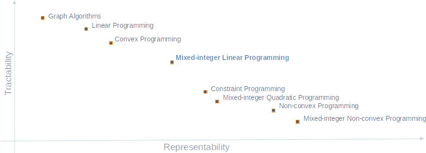

# Classes of Optimization
It's important to know that there are many classes of optimization problems, 
which are typically defined based on three aspects:
* *Modeling assumptions*, such as deterministic (assumed no uncertainty
  around the input data) or stochastic (some input data may come as
  probability distributions)
* *Type of decision variables present in the model*, such as
continuous, integer, or both
* *Type of expressions defining the objective and
constraints*, such as linear, convex, non-convex

Our primary focus will be on deterministic approaches with emphasis on
*Mixed-integer Linear Programs* (MILP). The following plot justify our
choice (but keep in mind that this is just an illustration and was not derived 
in any scientific manner). 

Specifically, MILP strikes a good balance between what we can model
and what we can practically solve. In addition, MILP is a generalization
of *Linear Programming* (LP) and very close related to 
*Constraint Programming* (CP), which gives us a wider range of 
representativeness and tractability.

🗒️ **Note:** 
*Some people prefer the word “optimization” instead of “programming”, 
in which case the acronym becomes MILO.*

Next, we provide some more details about the three main classes of
optimization problem we will be working with.

## Linear Programming (LP)
*Linear Programming* (LP) is one of the most basic classes of optimization 
problems. In this class, all variables are assumed to be continuous and
only [linear expressions][linear_expressions] are allowed. The Diet Problem, 
for example, is a classic example of a problem that can be modeled as an LP.

A very important fact about LP is that it's very tractable. In fact, 
professional implementations of the *Simplex* and *Interior Point*
algorithms can solve real-world instances with millions of variables 
and constraints in a matter of minutes!

Another relevant fact is that LP form the basis to solve more challenging
problems.

## Mixed-integer Linear Programming (MILP)
This class of optimization problems can be seen as and extension of LP.
The word "integer" is for integer decision variables, i.e., variables
that can only take whole values such as -2, 0, 4, 10.  A especial case is 
when the decision variables can only take the values 0 or 1, which we call 
binary variables.

Integer and, in particular, binary variables, are extremely useful to
model real-world problems because they can be used to formulate discrete 
events. A classic example of a problem that can be formulated with binary 
variables is the *Traveling Salesman Problem* (TSP), which we will study 
later in this program.

Finally, the word “mixed” is to indicate a mix of continuous and integer 
decision variables. This is what we find more often in real-world
applications. However, MILP problems are much harder to solve compared to 
LP problems. We will come back to this topic later.

## Constraint Programming (CP)
Constraint programming is close related to MILP in the sense that they
both can handle highly combinatorial problems. In fact, many problems
that are solved with CP can theoretically also be solved with MILP. 
However, CP is more suitable for feasibility problems, such as puzzles and 
scheduling problems, where we don't necessarily intend to optimize anything. 
Performance of CP solvers tends to deteriorate as the number of continuous
variable in the model increases. In fact, CP is more suitable for pure
integer problem.

In addition, the type of algorithms used to tackle CP is fundamentally 
different from those used for solving MILP.

[linear_expressions]: ../../miscellaneous/notebooks/linear_expressions.ipynb

------------------------------------------------------------------------------

Next, we will talk about the implementation of a mathematical
formulation.

### [Home][home] | [Back][back] | [Next][next] | [Help][help]

[home]: ../../README.md
[back]: ../2_tictech_formulation/README.md
[next]: ../4_optimization_model/README.md
[help]: ../../0_help/README.md