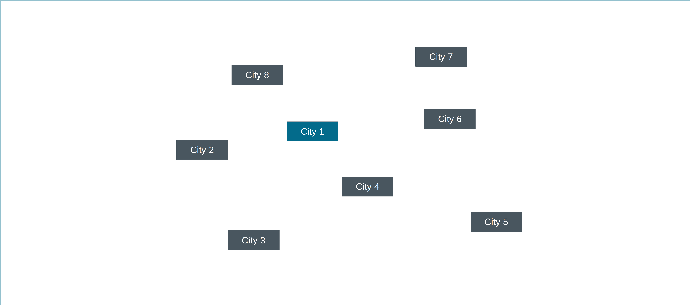

# Routing Problems
Routing problems are especial cases of network flow problems. We have a 
dedicates section to study routing problems for two reasons:
1) It's of big relevance in practice, in particular in last-mile delivery;
2) The underlying network typically has cycles, which adds a great deal 
   of complexity and require special treatment.

A practical example of a routing problem, a vehicle routing 
problem in this case, is the 
[GrabBro](https://www.mipwise.com/use-cases/grabbro) use case. In this 
problem, the goal is to determine the best route for a single driver to pick up 
multiple items from multiple grocery stores.

Another example, slightly more involving, is the
[Woodler](https://www.mipwise.com/use-cases/woodler) use case. In this
problem, the goal is to optimally allocate trucks to deliver products to
multiple demand locations. Because trucks have limited capacity, multiple 
trucks are typically required and, in which case multiple routes will compose 
the final solution.

But even before going into these use cases, let's visit the most basic 
and classic version of a routing problem, the Traveling Salesman Problem (TSP).

## Traveling Salesman Problem (TSP)
Starting from City 1, a traveling salesman must visit all the other 7 cities 
and return to City 1. The cost of traveling between any pair of cities is 
given in the [Transit Matrix](data/tsp/travel_costs.csv) table. Which route 
should the salesman take to minimize the total cost of his tour?

------------------------------------------------------------------------------

In the next section, we will study multi-period problems.

### [Up][up] | [Back][back] | [Next][next] | [Help][help]

[up]: ../README.md
[back]: ../1_network_flow_problems/README.md
[next]: ../3_multi_period_problems/README.md
[help]: ../../0_help/README.md