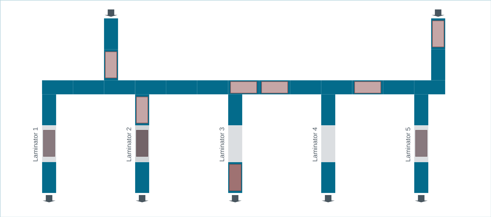

# Multi-Period Problems
Very often we want to make decisions over a time horizon when decisions made 
for one time period may impact decisions for other periods. 

A good example are production problems where there is the option to hold 
inventory from one period to the next. The 
[Pastesian](https://www.mipwise.com/use-cases/pastesian) and the 
[Frisbee Square](https://www.mipwise.com/use-cases/frisbee-square) use cases 
illustrate this situation very well.

One thing that become apparent as soon as we start to solve these problems 
is that there is an underlying network where nodes are period in time and 
arcs are links between there period--it's typically helpful to picture that 
network when solving the problem. As a result, flow balance constraints 
always show up in the formulation of these problems.

Transportation problems, including routing, will often have a time component 
too. For example, when there are time windows to pick up or delivery. In 
this case, the underlying network spans in space and time.

## Mip Solar
Mip Solar manufactures solar panels. One of the production stages is to heat 
the panel so that different layers of the material melt together. This 
heating process occurs inside the so-called laminators, and we assume it 
lasts 10 seconds.

Panels move from the previous production stage to laminators over conveyors. 
Each conveyor operates independently, meaning that a conveyor can move a panel 
back and forth at any time. Additionally, a panel can stay on a conveyor for 
as much time as needed, and it takes 1 second for a panel to move from one 
conveyor to another.

The planers at Mip Solar want to maximize the throughput of solar panels.

*OBS: This is a simplified version of a problem that Mip Wise solved for one of 
its clients. We presented it here just to illustrate a relevant real-world 
application of the topic being studied in this module. But due to 
contractual reasons, we won't solve this problem.*

## MipEx (with due time)
Let's revisit the [MipEx](../1_network_flow_problems/README.md) use case.

This time, we assume that each commodity has an arrival time, the hour of 
the day that the commodity is ready to leave its origin station, and a due 
time, the hour of the day that the commodity must be at its destination station.
All this information is provided in the
[Commodities](data/commodities.csv) table.

The transit distance, transit time, transportation cost, and the maximum 
number of trucks that can travel on each arc in a day are given in the 
[Transportation Lanes](data/transportation_lanes.csv) table.

The goal is to deliver all commodities on time at minimum cost.

It's important to note that the cost of a truck is the same whether the 
truck is full of partially full. On the other hand, commodities can stay at 
a site for as long as needed to leverage loads consolidations.

------------------------------------------------------------------------------

In the next section, we will study scheduling problems.

### [Up][up] | [Back][back] | [Next][next] | [Help][help]

[up]: ../README.md
[back]: ../2_routing_problems/README.md
[next]: ../4_scheduling_problems/README.md
[help]: ../../0_help/README.md